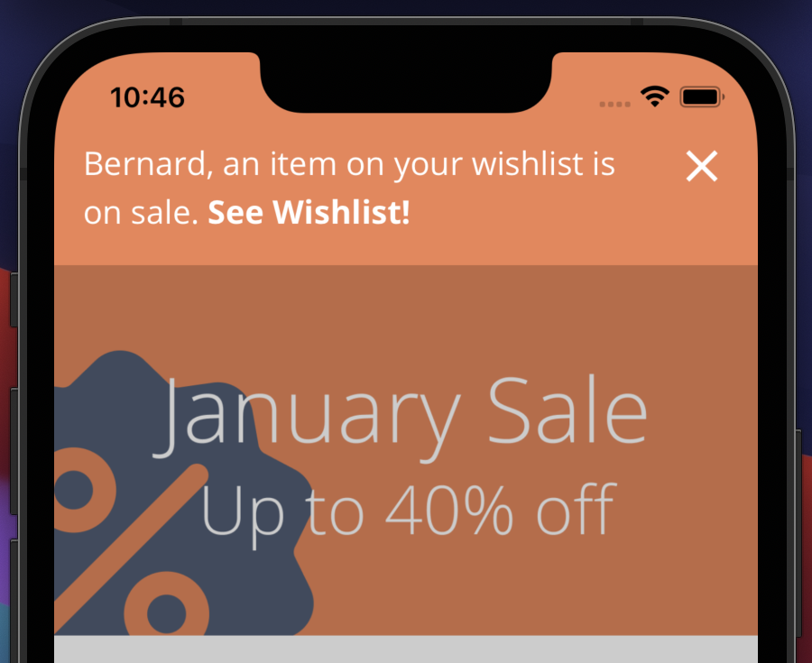

# Getting Started

This guide will walk you through the basic setup of Gist, how to install the library, and send a personalized message to a customer.

### Adding the Gist library



The Gist library can be added either via an NPM package or by using the script directly.


#### NPM Package

```shell
npm install --save @gistproduct/web
```

Import the dependency into your file

```javascript
import Gist from '@gistproduct/web';
```


**CDN**

```html
<script src="https://code.gist.build/web/stable/gist.min.js"></script>
```



Add the Gist pod into your **Podfile**

```ruby
pod 'Gist', '~> 2.1.0'
```



Add the **Gist** library to your app's **build.gradle**

```groovy
implementation 'build:gist:2.+'

repositories {
    maven {
        url 'https://maven.gist.build'
    }
}
```



Add the Gist library via NPM

```bash
npm install @gistproduct/react-native
```


Open the `build.gradle` file located inside the `android` directory and add the Gist maven repository.       &#x20;

```
allprojects {
    repositories {
        ...
        maven { url 'https://maven.gist.build' }
    }
}
```


Link the Gist pod with react native project

```bash
npx pod-install
```



Add the Gist library

```yaml
dependencies:
  flutter:
    sdk: flutter

  gist_flutter: ^1.1.1
```


#### On Android

Open the **Project** build.gradle file and update your kotlin version

```
ext.kotlin_version = '1.5.30'
```

Open the **App** build.gradle file and update the minimum SDK version

```
minSdkVersion 19
```

**Note:** If a version is higher then the one specified here, you can leave it as is.


#### On iOS

Open the project's **.xcworkspace** file, select the project and make sure the **deployment target** is 10 or higher.




### Setting up Gist

Copy your **Organization Id** from [Integrations](https://app.gist.build/integration)



```javascript
Gist.setup({ organizationId: "your-organization-id" });
```



```swift
Gist.shared.setup(organizationId: "your-organization-id")
```



```kotlin
GistSdk.getInstance().init(this, "your-organization-id")
```



```javascript
Gist.setup("your-organization-id");
```



```dart
Gist.setup("your-organization-id");
```



### Identifying your customers

Link your unique customer identifier to Gist



```javascript
Gist.setUserToken("unique-user-token");
```



```swift
Gist.shared.setUserToken("unique-user-token")
```



```kotlin
GistSdk.getInstance().setUserToken("unique-user-token")
```



```javascript
Gist.setUserToken("unique-user-token");
```



```dart
Gist.setUserToken("unique-user-token");
```



### Previewing a message

The message editor enables you to preview messages directly in your product. To make the message feel more personal, we're going to include the customer's name.




Congratulations! You managed to integrate the Gist library and send your first message. If you're interested in integrating Gist with your router to show messages on specific screens, subscribe to topics so that you can send broadcasts, and more. Every library has its own documentation:

* [Web](libraries/web.md)
* [iOS](https://gitlab.com/bourbonltd/gist-apple)
* [Android](https://gitlab.com/bourbonltd/gist-android)
* [React Native](libraries/react-native.md)
* [Flutter](libraries/flutter.md)

### Ways to send messages

Gist supports both direct user messages and broadcasts, this means that you can either send personalized messages directly to a specific user or reach an audience within your user base.

If you're looking to send personalized in-app messages or reach an audience using data from your CRM our [webhook](api/webhook.md) can help you achieve that.

To reach audiences with no additional integration, Gist offers a feature called [Broadcasts](broadcasts.md). This enables you to schedule and send in-app messages from our app.

### Support

If you have any questions or need help setting up Gist you can reach us using live chat or through [email](mailto:support@gist.build).
