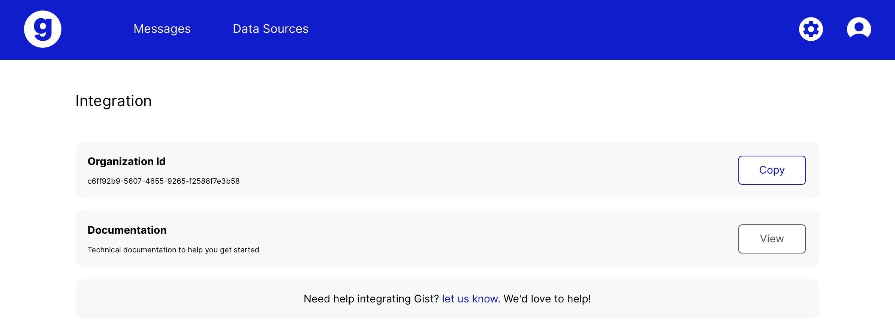

# Customer.io

Within the campaign / broadcast editor drag the webhook workflow item

.png>)

Select the newly dragged webhook item, edit the name to something recognizable Ex: Send In-App Message and select **Add Request**

.png>)

#### Update the following details <a href="#update-the-following-details" id="update-the-following-details"></a>

**Method**

`POST`

`https://queue.api.gist.build/api/v1/messages`

**Headers**

Add 2 new headers called **X-Bourbon-Organization-Id** and **X-Gist-Service-Key**.

.png>)

The organization id value can be fetched from the [integrations](https://app.gist.build/integration) section within Gist web app.



In order to have full control over where messages can be queued from, let's create a new [Service Key](https://app.gist.build/account/service-keys) and call it **Customer.io**. Doing so will give you the possibility to revoke keys whenever they are not used anymore.

.png>)

To trigger a simple in-app message you can use the following snippet:

```javascript
{
	"messageId": "the-message-id",
	"userToken": "{{customer.id}}",
	"priority": 1
}
```

Replace the-message-id with your message id. This can be fetched from the message settings screen. Note that the above snippet assumes that you'll be using the customer id as a unique identifier.

To test that everything is working properly, try sending a test.

.png>)

Once you're happy with the result.

Select **Done**.

Gist gives you the possibility to include additional information within your in-app messages. The full documentation about the Gist webhook can be found [here](../api/webhook.md).

If you have any additional questions or need help setting up please let us know.
